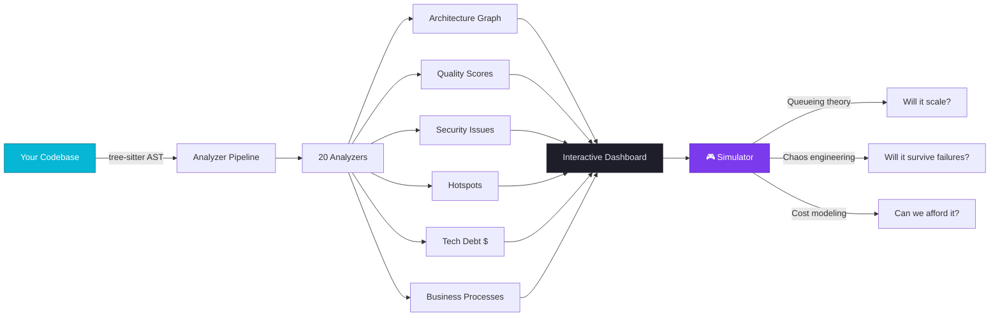
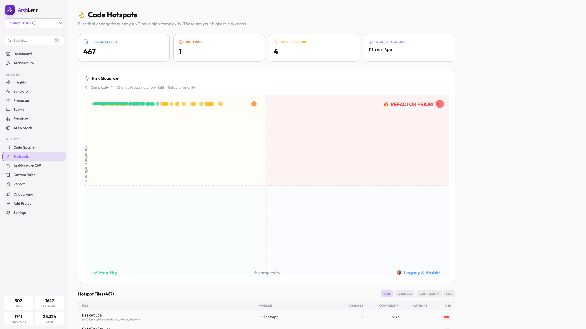
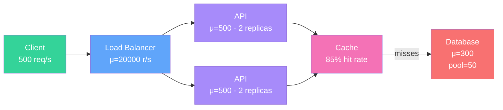
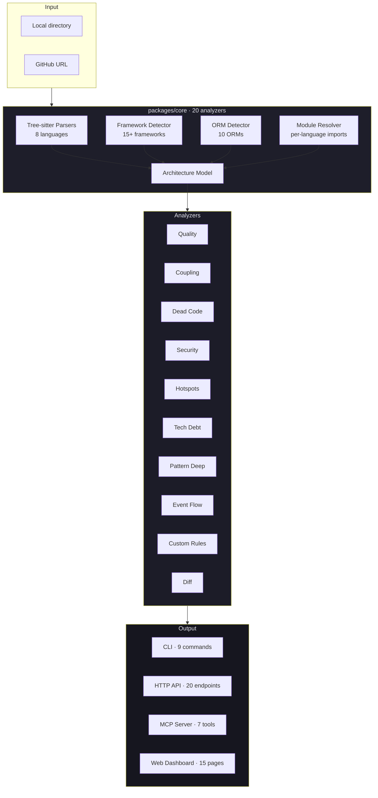

<div align="center">


# ArchLens

### See your codebase. Test your architecture. Before production.

**The only code intelligence platform that combines brownfield analysis with distributed-system simulation.**

[](https://github.com/muhsinelcicek/archlens/actions/workflows/ci.yml)
[](#-testing)
[](#-supported-languages--frameworks)
[](LICENSE)
[](package.json)
[](package.json)
[](https://www.typescriptlang.org/)
[](CONTRIBUTING.md)

[**🚀 Quick Start**](#-quick-start) · [**✨ Features**](#-features) · [**🎮 Simulator**](#-the-simulator-is-what-makes-archlens-different) · [**🤖 MCP / AI**](#-ai-integration-mcp) · [**📊 Comparison**](#-how-archlens-compares) · [**💰 Pricing**](#-pricing)

---

**Analyze any GitHub repo in 60 seconds. See the architecture. Find the bottlenecks. Simulate the failure modes. All before you touch production.**

</div>

---

## 📑 Table of Contents

- [Why ArchLens?](#-why-archlens)
- [What It Does](#-what-it-does-at-a-glance)
- [Features](#-features)
- [Screenshots](#-screenshots)
- [The Simulator](#-the-simulator-is-what-makes-archlens-different)
- [Quick Start](#-quick-start)
- [Architecture](#-how-it-works-internally)
- [Supported Languages & Frameworks](#-supported-languages--frameworks)
- [CLI Reference](#-cli-reference)
- [AI Integration (MCP)](#-ai-integration-mcp)
- [Real-World Examples](#-real-world-examples)
- [How ArchLens Compares](#-how-archlens-compares)
- [Pricing](#-pricing)
- [Testing](#-testing)
- [Performance](#-performance)
- [Roadmap](#-roadmap)
- [Contributing](#-contributing)
- [FAQ](#-faq)
- [License](#-license)

---

## 💡 Why ArchLens?

Every codebase ships with four hidden time bombs:

1. **Structural debt** nobody mapped
2. **Bottlenecks** nobody load-tested
3. **Circular dependencies** the compiler didn't complain about
4. **Dead code** that costs you every sprint

Other tools give you one piece. ArchLens gives you the full picture — **from the exact code you're shipping.**

| Question you ask | What other tools do | **What ArchLens does** |
|---|---|---|
| *"What does this codebase actually do?"* | Show you a file tree | **Auto-detects 20+ business processes with data flows** |
| *"What breaks if I change `validateOrder`?"* | Find references | **Computes blast radius: direct (d=1), likely (d=2), transitive (d=3)** |
| *"Will we survive 10x traffic on Friday?"* | ¯\\_(ツ)_/¯ | **Run M/M/c queueing simulation on your real architecture** |
| *"Where's the tech debt?"* | Lint warnings | **Estimates fix cost in hours AND dollars, with ROI-sorted quick wins** |
| *"Should I trust this open-source repo?"* | Stars & README | **Quality score + hotspots + security scan in 60 seconds** |
| *"Our microservices are tangled — where?"* | Manual whiteboarding | **Circular dependency detection at module + symbol level** |
| *"Where is domain logic leaking?"* | Architecture reviews | **DDD / Clean Architecture / CQRS pattern detection with evidence** |

> **ArchLens is what happens if SonarQube, CodeScene, Structurizr, and a distributed-systems simulator had a baby — and that baby started from your real code, not a whiteboard.**

---

## 🎯 What It Does at a Glance



1. **Point ArchLens at any codebase** (local folder or GitHub URL)
2. **It parses, classifies, and builds a rich model** (modules, symbols, relations, layers, endpoints, entities, processes)
3. **20 analyzers extract insights** (quality, coupling, security, dead code, hotspots, tech debt, patterns, event flows)
4. **Interactive 15-page dashboard** to explore it all
5. **Simulator** lets you stress-test your architecture under synthetic load — before you ship

---

## ✨ Features

<table>
<tr><td width="50%" valign="top">

### 🔍 Code Intelligence
- **8 languages** — TypeScript, JavaScript, Python, Go, Java, Swift, Rust, C#
- **15+ frameworks** auto-detected — Express, NestJS, Next.js (App + Pages router), Fastify, Hono, Koa, FastAPI, Flask, Django, Django REST Framework, Spring Boot, JAX-RS, gin, echo, chi, fiber, gorilla/mux, Actix-web, Axum, Rocket, Vapor
- **10 ORMs** — EF Core, JPA, Prisma, TypeORM, Sequelize, SQLAlchemy, Django ORM, GORM, Diesel, Fluent
- **Tree-sitter** AST parsing (not regex)
- **Incremental analysis** with SHA-256 file hashing (**262× faster** on reruns)
- **Smart module detection** for monorepos (handles `src/`, `packages/`, `apps/` containers)

</td><td width="50%" valign="top">

### 📊 Architecture Analysis
- **Layer detection** — presentation, API, application, domain, infrastructure
- **Coupling metrics** — Ca (afferent), Ce (efferent), I (instability), A (abstractness), D (distance from main sequence)
- **Circular dependency** detection at **both** module and symbol level
- **Pattern analysis** — DDD, CQRS, Clean Architecture, Repository, Event-Driven, Microservice — **with evidence**, not just flags
- **Module quality scores** with language-aware rules
- **Dependency matrix** (NxN heatmap) with layer violations

</td></tr>
<tr><td width="50%" valign="top">

### 🛡️ Quality & Security
- **20 analyzers** total
- **Cyclomatic + cognitive complexity** per language
- **Dead code** detection with confidence levels
- **Security scanner** — 15+ regex patterns with CWE references (SQL injection, XSS, hardcoded secrets, path traversal…)
- **Vulnerable dependency** detection
- **Tech debt in hours AND dollars** — $150/hr default, configurable
- **Cross-cutting concern consistency** (error handling, logging)
- **Custom rules engine** — 6 prebuilt templates + JSON editor

</td><td width="50%" valign="top">

### 🔥 Hotspots & Change Intelligence
- **Git history × complexity** — Tornhill's "Code as a Crime Scene" methodology
- **Risk quadrant chart** — X=complexity, Y=change frequency
- **4 zones** — Healthy / Active-Simple / Legacy / 🔥 Refactor Priority
- **Change frequency** per file (last 6 months)
- **Author attribution** for each hotspot
- **Snapshot diff** — track how architecture evolves over time
- **Module-level risk aggregation**

</td></tr>
<tr><td width="50%" valign="top">

### 🤖 AI Integration (MCP)
- **Model Context Protocol** server with 7 tools
- Works with **Claude Code, Cursor, Windsurf, Zed**, and any MCP-compatible client
- Tools: `architecture`, `process`, `impact`, `onboard`, `drift`, `sequence`, `explain`
- AI assistants get **instant codebase context** without manual file loading
- Impact analysis in AI prompts — *"What breaks if I rename `User.id` to `User.uuid`?"*

</td><td width="50%" valign="top">

### 🎨 Interactive Web Dashboard
- **7 routes** — Dashboard, Architecture, Flows, Insights, Quality (8 tabs), Simulator, Settings
- **ConstellationGraph** — Railway × Block Diagram hybrid: glowing nodes, always-flowing particles, layered layout
- **Simulator** with 16 node types, incident detection, chaos engineering
- **React Query** cached data fetching — no duplicate API calls
- **Design system** — Card, Badge, ProgressBar, SlidePanel, TabBar components
- **Framer Motion** animations — slide-in panels, staggered entrances
- **2 themes** — Dark (default, Railway-inspired) + Light (soft gray-blue)
- **i18n** — English + Turkish
- **Executive PDF report** for stakeholders

</td></tr>
</table>

---

## 🎬 Demo

<!-- Replace with your actual video URL after recording -->
<div align="center">

https://github.com/user-attachments/assets/YOUR_VIDEO_ID_HERE

*3-minute walkthrough: analyze a project, explore the architecture, run the simulator.*

</div>

> **To add your demo video:** Record a 3-minute walkthrough, then drag-drop the `.mp4` into a GitHub issue or PR description. Copy the generated URL and paste it above.

---

## 📸 Screenshots

<table>
<tr>
<td width="50%" align="center">
<strong>ConstellationGraph</strong><br/>
<sub>Glowing nodes grouped by layer, always-flowing particles showing dependencies</sub><br/>

</td>
<td width="50%" align="center">
<strong>Simulator</strong><br/>
<sub>M/M/c queueing, incident detection, chaos engineering, cost modeling</sub><br/>

</td>
</tr>
<tr>
<td width="50%" align="center">
<strong>Dashboard</strong><br/>
<sub>Health score, pulse bars, action items, simulator results</sub><br/>

</td>
<td width="50%" align="center">
<strong>Smart Insights</strong><br/>
<sub>AI-style narrative findings from all analyzers</sub><br/>

</td>
</tr>
<tr>
<td width="50%" align="center">
<strong>Quality Overview</strong><br/>
<sub>Score ring, severity breakdown, architecture patterns</sub><br/>

</td>
<td width="50%" align="center">
<strong>Request Flows</strong><br/>
<sub>Endpoint → handler → dependencies call chain (all languages)</sub><br/>

</td>
</tr>
<tr>
<td width="50%" align="center">
<strong>Coupling & Consistency</strong><br/>
<sub>Instability metrics, circular deps, cross-cutting concerns</sub><br/>

</td>
<td width="50%" align="center">
<strong>Hotspots</strong><br/>
<sub>Git change frequency × complexity (shallow clone aware)</sub><br/>

</td>
</tr>
</table>

> **Screenshots are placeholders** until you capture real ones. Start the dashboard (`archlens serve` + `pnpm dev`) and take screenshots of each page.

---

## 🎮 The Simulator is what makes ArchLens different

Other tools analyze code. **ArchLens simulates what your code does under load.** The simulator is not a toy — it's built on real distributed-systems math.



**Under the hood:**

| Feature | Implementation |
|---------|----------------|
| **Queueing model** | M/M/c approximation (Little's Law) — latency grows non-linearly as ρ → 1 |
| **Latency percentiles** | P50/P95/P99 via normal-distribution approximation + queue-delay multiplier |
| **Error modeling** | Ramps at 80% utilization, compounds past 100% saturation |
| **Circuit breakers** | Full state machine (closed → open → half-open) with configurable threshold + cooldown |
| **Retry logic** | Per-node retry count (0-5) with effectiveness calculation |
| **Auto-scaling** | HPA-style policies with min/max replicas, up/down thresholds, cooldown |
| **Chaos engineering** | Random kills, latency injection, network partitions, flaky/slow node modes |
| **Traffic patterns** | 6 patterns — constant, burst, ramp, spike, periodic (sine wave), noise |
| **Cost modeling** | $/replica/hour + $/1M requests → monthly cost estimate |
| **Cache specifics** | Hit rate slider, cache stampede penalty under overload |
| **DB specifics** | Connection pool limit separate from capacity |
| **AI root cause** | Automatically identifies bottlenecks, suggests scale actions |
| **Incident detection** | 15 types: SPOF, CASCADE, OVERLOAD, 502, TOPOLOGY PRESSURE, HEALTH CHECK, etc. |
| **FIX buttons** | One-click remediation: scale replicas, increase cooldown |
| **Simulation report** | Export Markdown report with incident history + recommendations |
| **16 node types** | Client, LB, API, Service, DB, Cache, Queue, CDN, Lambda, Gateway, Auth, Broker, Storage, DNS, Container, Monitoring |

**Pre-built scenarios you can load with one click:**

| Template | Topology |
|----------|----------|
| 🛒 **E-commerce** | Client → LB → API → [Cart, Checkout, Catalog] → Cache → PostgreSQL |
| 🔗 **Microservices** | Gateway → [Auth, User, Order, Payment, Notify] → [Redis, User DB, Order DB] |
| ⚡ **Event-Driven** | Producer → Queue → 3× Workers → TimeSeries DB |
| 🌐 **CDN + Origin** | Users → CDN (95% hit) → Origin LB → API → Cache → DB |
| 📊 **Data Pipeline** | Sources → Collector → Raw Queue → Transform → Clean Queue → Loader → Warehouse |

**Pre-built load tests:** Baseline · Black Friday (5× burst) · Launch Day (ramp 100→3000) · DDoS (10× spike) · Daily Pattern (sine wave)

> **Ask your system the questions that matter:** *Does Basket.API fall over at 2000 req/s? What's the cost of 99.9% vs 99.99% availability? Will my 5-replica cluster survive an AZ failure? Would adding Redis in front of Postgres fix the P99 latency?*
> 
> **ArchLens answers them — without touching production.**

---

## 🚀 Quick Start

### Install

```bash
npm install -g archlens
```

### Analyze your project (local)

```bash
cd your-project
archlens analyze .
archlens serve
# → http://localhost:4848
```

### Import a GitHub repo (no git clone needed)

```bash
archlens add https://github.com/dotnet/eShop
archlens serve
```

### Wire up AI (Claude Code, Cursor, Windsurf…)

```bash
archlens setup
```

That's it. You're running.

---

## 🏗️ How It Works Internally



**Monorepo layout:**

```
archlens/
├── packages/
│   ├── core/     # Analysis engine — parsers, analyzers, models, generators
│   ├── cli/      # Command-line tool (9 commands) + HTTP API server
│   ├── mcp/      # Model Context Protocol server (7 tools for AI)
│   └── web/      # React + Vite + Tailwind dashboard (15 pages)
├── e2e/          # Playwright E2E tests (16 tests)
├── docs/         # Landing page + guides
└── .github/      # CI, PR templates, issue templates, security policy
```

**Key technical decisions:**
- ✅ **Tree-sitter** over regex — accurate AST parsing for 8 languages
- ✅ **Sigma.js + graphology + WebGL** — graph renders 10k+ nodes smoothly
- ✅ **Regex-based Framework Detector** — post-processes AST output, catches what parsers miss (each framework ~4 hours to add)
- ✅ **Zustand** over Redux — lightweight state for 15-page app
- ✅ **React.lazy() per route** — initial bundle **51KB** (was 1.4MB before splitting)
- ✅ **SSE for file watcher** — `/api/watch` streams change events, web reconnects on project switch
- ✅ **`.archlens/` per project** — local cache, snapshots, rules, comments — nothing phones home

---

## 🌐 Supported Languages & Frameworks

| Language | Parser | Endpoint Frameworks | ORMs | Quality Rules | Patterns |
|----------|--------|---------------------|------|---------------|----------|
| **C# / .NET** | ✅ tree-sitter-c-sharp | ASP.NET Core, Minimal APIs | EF Core | 5 | DDD, Clean Arch |
| **TypeScript** | ✅ tree-sitter-typescript | Express, NestJS, Next.js App Router, Next.js Pages Router, Fastify, Hono, Koa | Prisma, TypeORM, Sequelize | 5 | Hexagonal |
| **JavaScript** | ✅ tree-sitter-javascript | Express, Koa, Hono | Sequelize | 3 | — |
| **Python** | ✅ tree-sitter-python | FastAPI, Flask, Django, Django REST Framework | SQLAlchemy, Django ORM | 5 | — |
| **Java** | ✅ tree-sitter-java | Spring Boot (`@RestController`, `@RequestMapping`, `@GetMapping`…), JAX-RS | JPA `@Entity` | 3 | DDD |
| **Go** | ✅ tree-sitter-go | gin, echo, chi, fiber, gorilla/mux, net/http | GORM | 3 | — |
| **Rust** | ✅ tree-sitter-rust | Actix-web, Axum, Rocket | Diesel | 2 | — |
| **Swift** | ✅ tree-sitter-swift | Vapor | Vapor Fluent | 1 | — |

**Battle-tested against:** [dotnet/eShop](https://github.com/dotnet/eShop) (502 files, 14 endpoints), [tiangolo/fastapi](https://github.com/tiangolo/fastapi) (532 files, **435 endpoints**), [spring-petclinic](https://github.com/spring-projects/spring-petclinic) (30 files, 18 endpoints + 6 JPA entities), [gin-gonic/examples](https://github.com/gin-gonic/examples) (59 files, 35 endpoints).

---

## 💻 CLI Reference

| Command | Description | Example |
|---------|-------------|---------|
| `archlens analyze <path>` | Analyze a local project | `archlens analyze ./my-app` |
| `archlens serve [--port N]` | Start dashboard (default :4848) | `archlens serve --port 5000` |
| `archlens add <github-url> [--branch]` | Clone + analyze GitHub repo | `archlens add https://github.com/org/repo --branch develop` |
| `archlens list` | List registered projects | — |
| `archlens remove <name>` | Remove project from registry | `archlens remove eShop` |
| `archlens export <format>` | Export model (json, svg, mermaid) | `archlens export json > arch.json` |
| `archlens review` | Print architecture review to terminal | — |
| `archlens mcp` | Start MCP server (stdio) | — |
| `archlens setup [--tool]` | Configure MCP for Claude Code / Cursor | `archlens setup --tool claude` |

---

## 🤖 AI Integration (MCP)

Add ArchLens to any **[Model Context Protocol](https://modelcontextprotocol.io)** client — Claude Code, Cursor, Windsurf, Zed — for instant codebase context:

```json
{
  "mcpServers": {
    "archlens": {
      "command": "npx",
      "args": ["archlens", "mcp"]
    }
  }
}
```

### The 7 MCP Tools

| Tool | When your AI should use it | Example prompt |
|------|---------------------------|----------------|
| `architecture` | Understanding structure | *"What are the main modules?"* |
| `process` | Understanding business flows | *"Walk me through the checkout process"* |
| `impact` | Before making changes | *"What breaks if I modify `validateUser`?"* |
| `onboard` | New developer context | *"I'm new — give me an overview"* |
| `drift` | Branch review | *"What architectural changes did this PR make?"* |
| `sequence` | Tracing call paths | *"Trace the call chain from POST /api/orders"* |
| `explain` | Deep context on a symbol | *"What does `calculateTax` do and where is it used?"* |

> **Why this matters:** Instead of pasting 50 files into your AI's context, it asks ArchLens exactly what it needs — saving tokens and giving better answers.

---

## 📈 Real-World Examples

### Example 1: [dotnet/eShop](https://github.com/dotnet/eShop) (502 files, 23k LOC)

```bash
archlens add https://github.com/dotnet/eShop
archlens review
```

ArchLens detected:
- ✅ **22 modules** classified into 6 layers
- ✅ **14 ASP.NET Core endpoints** (including `[controller]`/`[action]` placeholder resolution)
- ✅ **10 EF Core entities** with cross-file column enrichment
- ✅ **71 NuGet packages** in tech radar
- ✅ **21 domain events** across 19 bounded contexts
- ⚠️ **3 circular dependencies** between modules
- ⚠️ **16 security issues** (score 52/100)
- ⚠️ **390 unused symbols** — 15,649 lines of potential cleanup
- 💰 **$41,887 in technical debt** with 3 quick wins identified
- 🔥 **Top hotspot:** `ClientApp/Basket.cs` (complexity 1909, risk score 100)

Quality score: **91/100**

### Example 2: FastAPI repo

```bash
archlens add https://github.com/tiangolo/fastapi
```

- **435 endpoints** detected across test fixtures and docs code
- **532 files, 33,445 lines** analyzed in under 3 seconds (with incremental cache: 12ms on reruns)

### Example 3: Spring PetClinic

```bash
archlens add https://github.com/spring-projects/spring-petclinic
```

- **18 Spring REST endpoints** — all `@GetMapping`, `@PostMapping`, prefix-aware
- **6 JPA entities** with `@Id` primary keys detected
- **1 module** (monolith), instability 0.0 (no dependencies out)

---

## 📊 How ArchLens Compares

| Feature | **ArchLens** | SonarQube | CodeScene | Structurizr | Paperdraw |
|---------|:------------:|:---------:|:---------:|:-----------:|:---------:|
| Multi-language | ✅ **8** | ✅ | ✅ | — | — |
| Architecture-aware quality | ✅ | ⚠️ | ✅ | — | — |
| Auto-detected layers/patterns | ✅ | — | ⚠️ | — | — |
| Hotspot analysis (git × complexity) | ✅ | — | ✅ | — | — |
| **Architecture simulator** | ✅ | — | — | — | ✅ |
| **Simulator starts from real code** | ✅ | — | — | — | — |
| **Queueing theory (M/M/c)** | ✅ | — | — | — | ⚠️ |
| **Circuit breakers in simulator** | ✅ | — | — | — | — |
| **Cost modeling** | ✅ | — | — | — | ⚠️ |
| MCP / AI integration | ✅ | — | — | — | — |
| Self-hosted | ✅ | ✅ | ✅ | ✅ | — |
| Open source | ✅ MIT | LGPL v3 | proprietary | MIT | proprietary |
| Cloud-hosted option | 🔜 | ✅ | ✅ | ✅ | ✅ |

**ArchLens is the only tool that lets you simulate your real architecture under load.** Paperdraw gives you a whiteboard. Structurizr gives you diagrams-as-code. ArchLens gives you answers about **your actual code**.

---

## 💰 Pricing

<table>
<tr><th width="50%">🎁 Community Edition</th><th width="50%">💼 Pro / Enterprise</th></tr>
<tr><td valign="top">

**Free · MIT License · Forever**

Perfect for individual developers, open source projects, and small teams.

- ✅ All 8 languages and 15+ frameworks
- ✅ All 15 dashboard pages
- ✅ **Full Architecture Simulator** — no feature gating
- ✅ MCP integration for AI tools
- ✅ Self-hosted (runs locally, nothing phones home)
- ✅ Unlimited projects and snapshots
- ✅ Custom rules engine
- ✅ Executive PDF reports
- ✅ Community support via GitHub

[**⭐ Get started on GitHub →**](https://github.com/muhsinelcicek/archlens)

</td><td valign="top">

**Custom pricing · Coming soon**

For teams and organizations that need more.

- ✅ Everything in Community
- 🔜 **Team collaboration** — shared snapshots, review workflows
- 🔜 **CI/CD integration** — break builds on architecture violations
- 🔜 **SSO / SAML** — Okta, Azure AD, Google Workspace
- 🔜 **Audit logs** — SOC 2, ISO 27001 ready
- 🔜 **Central rule library** — enforce policies across repos
- 🔜 **Slack / Teams notifications** — alert on drift
- 🔜 **Hosted cloud option** — we run it for you
- 🔜 **Priority support** — SLA-backed
- 🔜 **Custom integrations** — ServiceNow, Jira, GitHub Enterprise

[**📧 Contact sales →**](mailto:archlens@example.com)

</td></tr>
</table>

---

## 🧪 Testing

**205 tests** across 4 suites — all passing on every commit:

```bash
pnpm test            # 186 unit tests
pnpm test:e2e        # 16 Playwright E2E tests
pnpm typecheck       # TypeScript across all packages
```

| Suite | Count | What it covers |
|-------|:-----:|----------------|
| `@archlens/core` unit | **136** | parsers (8 languages), quality, coupling, dead code, security, hotspots, tech debt, framework detector (15+ frameworks), event flow, process detector, consistency |
| `@archlens/web` unit | **34** | Simulator engine: queueing theory curves, circuit breaker state machine, 6 traffic patterns, error rate thresholds, root cause analysis |
| `@archlens/cli` unit | **16** | HTTP API response shape validation for all endpoints |
| E2E (Playwright) | **16** | Every page loads, sidebar navigation, simulator flows (run, pause, template load, chaos), API reachability |

**Framework detector real-world regression tests:**
- FastAPI: 435 endpoints detected ✓
- Spring PetClinic: 18 endpoints + 6 entities ✓
- gin-gonic/examples: 35 endpoints ✓
- eShop: 14 endpoints + 10 EF Core entities ✓

---

## ⚡ Performance

| Operation | Cold | Warm (incremental cache) | Speedup |
|-----------|-----:|-------------------------:|:-------:|
| Analyze eShop (502 files, 23k LOC) | ~2.8s | ~12ms | **262×** |
| Analyze FastAPI (532 files, 33k LOC) | ~3.1s | ~15ms | **207×** |
| Analyze PetClinic (30 files) | ~0.4s | ~3ms | **133×** |

**Web dashboard bundle:**

| Bundle | Size | Loaded on |
|--------|-----:|-----------|
| Main app (`index.js`) | **51 KB** | Every page |
| vendor-react | 225 KB | Every page |
| vendor-icons | 41 KB | Every page |
| vendor-cytoscape | 609 KB | Only `/architecture` |
| vendor-sigma | 173 KB | Only `/architecture` |
| Each page view | 5–67 KB | On-demand |

**Initial Dashboard payload: ~150 KB gzipped.** Every route is a lazy chunk.

---

## 🗺️ Roadmap

### v0.2 — Q2 2026
- [ ] Distributed trace view in simulator (click a request, see full path)
- [ ] Comparison mode (A vs B architectures side-by-side)
- [ ] Multi-region topology with cross-region latency
- [ ] Phoenix (Elixir), Laravel (PHP), ASP.NET Minimal APIs frameworks
- [ ] Accessibility pass (WCAG 2.1 AA)
- [ ] Mobile-responsive sidebar + touch-friendly canvas

### v0.3 — Q3 2026
- [ ] VS Code extension
- [ ] Browser extension (analyze any GitHub repo in one click)
- [ ] GitHub Action for CI (break PR on architecture drift)
- [ ] Cloud-hosted demo
- [ ] AI-generated refactoring recommendations
- [ ] Custom theme editor

### v1.0 — Q4 2026
- [ ] SSO / SAML for Pro tier
- [ ] Team collaboration (presence, comments, shared snapshots)
- [ ] Slack / Teams / Discord integrations
- [ ] Jira / Linear issue creation from findings

**Want something on the list? [Open an issue.](https://github.com/muhsinelcicek/archlens/issues/new?template=feature_request.md)**

---

## 🤝 Contributing

ArchLens is open source and **contributions are welcome**. See **[CONTRIBUTING.md](CONTRIBUTING.md)** for:
- Local dev setup
- How to add a new language parser
- How to add a new framework detector
- PR checklist

**Good first issues:** [](https://github.com/muhsinelcicek/archlens/labels/good%20first%20issue)

---

## ❓ FAQ

<details>
<summary><strong>Does ArchLens send my code anywhere?</strong></summary>

**No.** ArchLens runs entirely locally. The CLI reads files, the HTTP API serves on `localhost:4848`, the web dashboard on `localhost:4849`. Nothing phones home — check the network tab yourself.
</details>

<details>
<summary><strong>How is the simulator different from real load testing?</strong></summary>

Load testing hits your actual running system — you need a deployed environment, you're measuring real latency, real errors, but you need real infrastructure.

ArchLens simulator is an **analytical model** — it runs on your laptop with no infrastructure. It won't catch OS-level bugs or dependency misconfigurations, but it will tell you **architecturally** if your design can handle the load, where the bottlenecks will be, and how adding a cache / replicas / circuit breaker will change the outcome — all before you pay for infrastructure.

They're complementary. Use ArchLens for design-time decisions, k6/Gatling for validation on your staging environment.
</details>

<details>
<summary><strong>What does "starts from real code" mean for the simulator?</strong></summary>

Paperdraw-style tools give you a blank canvas: drag nodes, draw arrows, simulate. Every simulation is hypothetical.

ArchLens pre-populates the simulator with **your actual modules and their real dependencies**, classified by layer, with capacity/latency defaults that match the component type (DB vs cache vs API). You can still edit, add what-if nodes ("what if we added Redis?"), but you start from truth.
</details>

<details>
<summary><strong>Does it work on monorepos?</strong></summary>

Yes. ArchLens has smart container detection — it recognizes `src/`, `packages/`, `apps/` directories and treats their children as modules. Tested on pnpm/Turborepo/Nx-style layouts.
</details>

<details>
<summary><strong>How accurate is the framework detection?</strong></summary>

Our published accuracy (tested against 4 real-world repos):

- C# / ASP.NET Core: ~95%
- FastAPI: ~95%
- Spring Boot: ~95%
- gin: ~95%
- NestJS: ~95%
- Next.js App + Pages Router: ~90%
- Flask, Django, Actix-web, Axum, Vapor: ~85–90%

False positives are rare. False negatives (missed endpoints) happen with custom routing helpers — you can fix with a custom rule or open an issue.
</details>

<details>
<summary><strong>Does ArchLens replace SonarQube?</strong></summary>

For most teams, **yes** — it does code quality, security, dead code, tech debt, and adds architecture + simulator on top.

For compliance-heavy enterprises that need specific certified scanners (FIPS, specific CWE coverage), SonarQube has more mature coverage. You can run both.
</details>

<details>
<summary><strong>Can I use ArchLens commercially?</strong></summary>

**Yes.** Community Edition is MIT-licensed — commercial use, modification, and redistribution are all allowed. The Pro/Enterprise features (coming soon) will have a commercial license for teams that need them.
</details>

<details>
<summary><strong>How do I keep my analysis up to date?</strong></summary>

ArchLens has a live file watcher (`/api/watch` SSE endpoint) — when a source file changes, the web dashboard shows a toast with a **Re-analyze** button. You can also set up a post-commit git hook:

```bash
# .git/hooks/post-commit
npx archlens analyze .
```
</details>

---

## 📜 License

**Community Edition** — [MIT License](LICENSE) · Free forever

**Pro / Enterprise** — [Commercial license](LICENSE.commercial) · Contact [sales@example.com](mailto:archlens@example.com)

---

## 🙏 Credits

Built with **TypeScript**, **React**, **Tree-sitter**, **Sigma.js**, **Cytoscape.js**, **Vitest**, and **Playwright**.

Inspired by SonarQube, CodeScene, Structurizr, and Paperdraw — combining the best ideas from each, adding what was missing.

---

<div align="center">

### Made for developers who want to know — not guess — what their architecture will do.

**[⭐ Star on GitHub](https://github.com/muhsinelcicek/archlens)** · **[📖 Read the Docs](docs/)** · **[🐦 Follow on Twitter](#)** · **[📧 Contact](mailto:archlens@example.com)**

</div>
