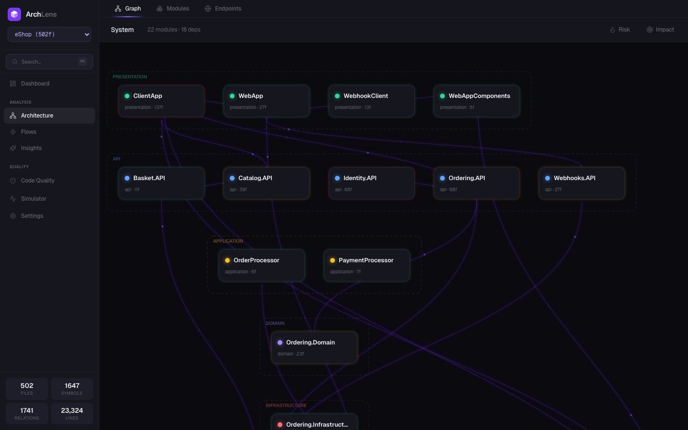
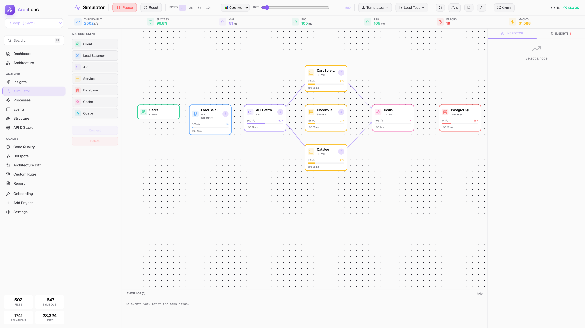
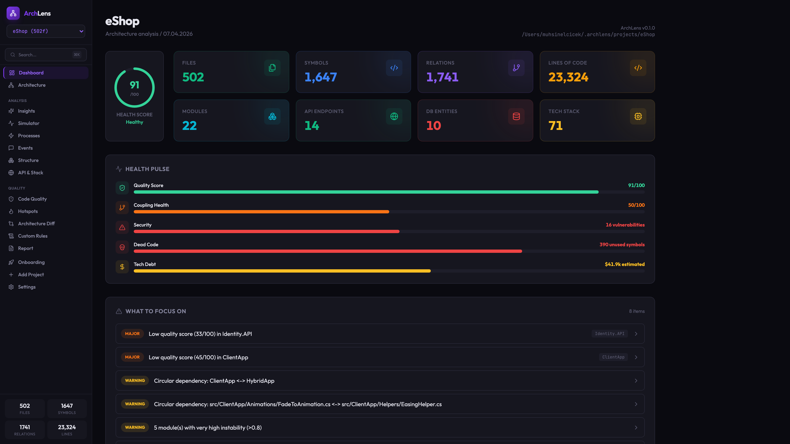
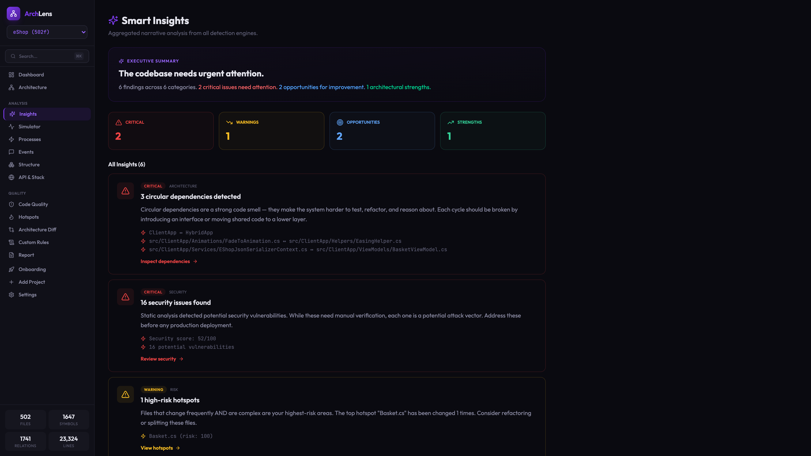
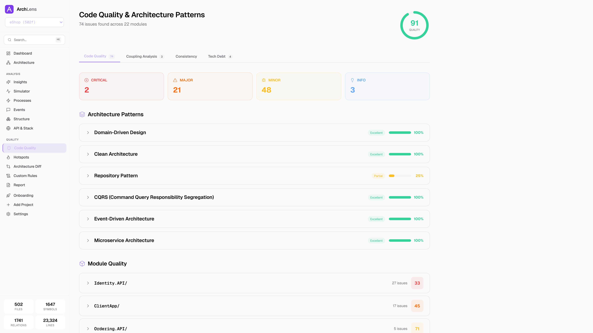
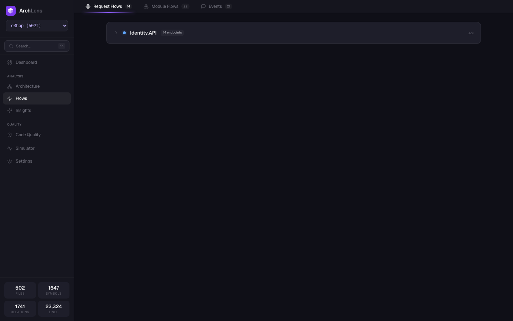

<div align="center">

# ArchLens

Code architecture analysis + distributed system simulation.

Analyze any codebase, visualize the architecture, simulate how it behaves under load.

[](#testing)
[](#supported-languages)
[](LICENSE)

</div>

---

## What it does

1. **Point it at a codebase** (local folder or GitHub URL)
2. **It parses and analyzes** — modules, dependencies, quality, security, dead code, tech debt
3. **You explore interactively** — constellation graph, request flows, insights
4. **You simulate** — queueing theory engine, chaos engineering, incident detection

## Screenshots

<table>
<tr>
<td width="50%"><br/><sub><strong>Architecture</strong> — ConstellationGraph with glowing nodes and flowing particles</sub></td>
<td width="50%"><br/><sub><strong>Simulator</strong> — drag-drop canvas with live metrics and incident badges</sub></td>
</tr>
<tr>
<td width="50%"><br/><sub><strong>Dashboard</strong> — health score, pulse bars, action items</sub></td>
<td width="50%"><br/><sub><strong>Insights</strong> — narrative findings from all analyzers</sub></td>
</tr>
<tr>
<td width="50%"><br/><sub><strong>Quality</strong> — score, patterns, coupling, consistency</sub></td>
<td width="50%"><br/><sub><strong>Flows</strong> — request chains from endpoint to database</sub></td>
</tr>
</table>

## Quick Start

```bash
npm install -g archlens

cd your-project
archlens analyze .
archlens serve
# → http://localhost:4848
```

Or import a GitHub repo:

```bash
archlens add https://github.com/dotnet/eShop
archlens serve
```

## Features

### Analysis
- **8 languages** — TypeScript, JavaScript, Python, Go, Java, Swift, Rust, C#
- **15+ frameworks** — Express, NestJS, Next.js, FastAPI, Flask, Django, Spring Boot, gin, Actix, Vapor, and more
- **10 ORMs** — EF Core, JPA, Prisma, TypeORM, SQLAlchemy, Django ORM, GORM, Diesel, Fluent, Sequelize
- **20 analyzers** — quality, coupling, security, dead code, hotspots, tech debt, patterns, consistency
- Tree-sitter AST parsing, incremental analysis with SHA-256 caching

### Visualization
- **ConstellationGraph** — layered layout with glowing nodes and always-flowing particles
- Request flow tracing — endpoint → handler → dependencies → database
- Impact analysis — blast radius visualization
- Risk/quality overlay toggles

### Simulator
- M/M/c queueing theory engine
- 16 node types (Client, LB, API, Service, DB, Cache, Queue, CDN, Lambda, Gateway, Auth, Broker, Storage, DNS, Container, Monitoring)
- Circuit breakers (closed/open/half-open state machine)
- Auto-scaling policies, retry logic
- 6 traffic patterns — constant, burst, ramp, spike, periodic, noise
- 5 scenario templates — E-commerce, Microservices, Event-Driven, CDN+Origin, Data Pipeline
- Chaos engineering — random kills, latency injection, AZ failure
- 15 incident types — SPOF, CASCADE, OVERLOAD, 502 BAD GATEWAY, TOPOLOGY PRESSURE, etc.
- Cost modeling — $/replica/hour, monthly estimates
- FIX buttons — one-click remediation
- Markdown report export

### AI Integration
- MCP server with 7 tools for Claude Code, Cursor, Windsurf
- Tools: `architecture`, `process`, `impact`, `onboard`, `drift`, `sequence`, `explain`

## Architecture

```
packages/
├── core/     Analysis engine (20 analyzers, 8 parsers, framework detector)
├── cli/      CLI + HTTP API server (9 commands)
├── mcp/      Model Context Protocol server (7 tools)
└── web/      React dashboard (Vite + Tailwind + React Query)
```

## Supported Languages

| Language | Endpoints | ORM | Quality Rules |
|----------|-----------|-----|---------------|
| TypeScript | Express, NestJS, Next.js, Fastify | Prisma, TypeORM, Sequelize | 5 |
| JavaScript | Express, Koa, Hono | Sequelize | 3 |
| Python | FastAPI, Flask, Django, DRF | SQLAlchemy, Django ORM | 5 |
| Java | Spring Boot, JAX-RS | JPA | 3 |
| Go | gin, echo, chi, fiber, gorilla/mux | GORM | 3 |
| C# | ASP.NET Core | EF Core | 5 |
| Rust | Actix-web, Axum, Rocket | Diesel | 2 |
| Swift | Vapor | Fluent | 1 |

## CLI Commands

| Command | Description |
|---------|-------------|
| `archlens analyze <path>` | Analyze a project |
| `archlens serve` | Start the web dashboard |
| `archlens add <github-url>` | Clone and analyze a GitHub repo |
| `archlens list` | List analyzed projects |
| `archlens remove <name>` | Remove a project |
| `archlens export <format>` | Export as JSON or SVG |
| `archlens review` | Print architecture review to terminal |
| `archlens mcp` | Start MCP server |
| `archlens setup` | Configure MCP for Claude Code / Cursor |

## MCP Integration

```json
{
  "mcpServers": {
    "archlens": {
      "command": "npx",
      "args": ["archlens", "mcp"]
    }
  }
}
```

## Testing

205 tests across 4 suites:

```bash
pnpm test        # 189 unit tests
pnpm test:e2e    # 16 Playwright E2E tests
```

## Development

```bash
git clone https://github.com/muhsinelcicek/archlens.git
cd archlens
pnpm install
pnpm build
pnpm test
pnpm dev
```

## Roadmap

- [ ] VS Code extension
- [ ] CI/CD integration (break build on violations)
- [ ] Simulator comparison mode (A vs B)
- [ ] More language-specific quality rules
- [ ] Performance benchmarks for 10K+ file projects

## License

[MIT License](LICENSE) — Copyright (c) 2026 Muhsin Elçiçek

Free to use, modify, and distribute.
